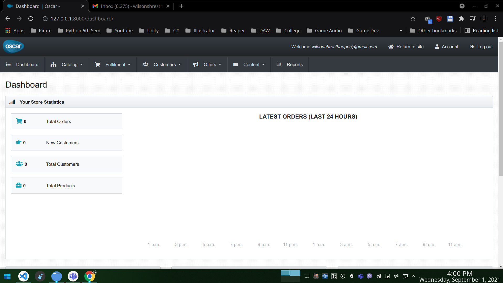

# Installing Django-Oscar

## Creating admin page (superuser)

python manage.py createsuperuser

For superuser:

email: wilsonshresthaapps@gmail.com
password: wilcy12345

For normal user:

user email: wakanda@gmail.com
password: Pandaman

## Superuser web interface
 