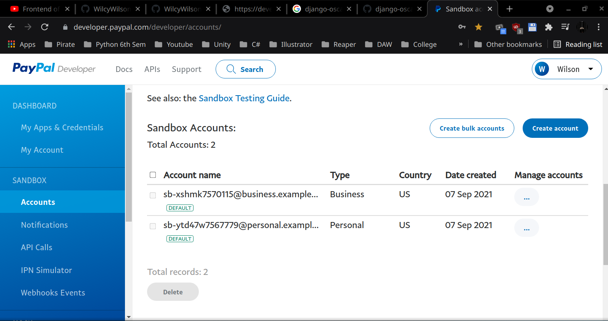

# Setting Up Payment Gateway

## To configure views and models

http://127.0.0.1:8000/admin

Add a country for shipping address otherwise won't work.

## install dhango-oscar-paypal

pip install django-oscar-paypal

## django-oscar-paypal docs

https://django-oscar-paypal.readthedocs.io/en/latest/

https://django-oscar-paypal.readthedocs.io/en/latest/express.html#getting-started

## Paypal Sandbox account details

First create a normal paypal account. Then go to the link.

https://developer.paypal.com/developer/accounts/

 

Click on edit for above business sandbox account. Copy API credentials to put it in settings.py

